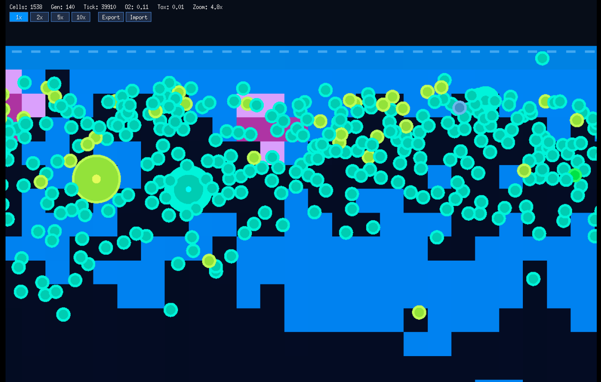
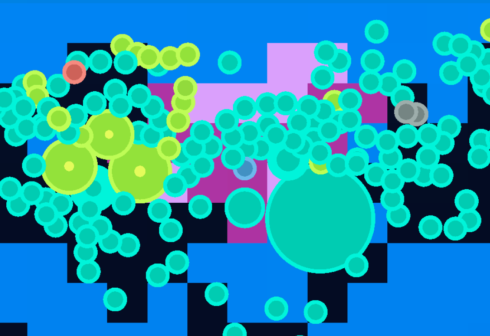

# Cellarium

An artificial life simulator where cells evolve, compete, and adapt inside a sealed bottle-shaped 2D environment. Written in Go with [Ebitengine](https://ebitengine.org/).





## What is this?

Cellarium simulates a tiny ecosystem from scratch. Cells are dropped into a bottle filled with sunlight, oxygen, and nutrients. Each cell carries a genome — a sequence of genes that controls its behavior. Through mutation and natural selection, cells evolve strategies to survive: some become photosynthesizers hugging the surface, others become predators hunting their neighbors, and some develop toxic defenses.

No behavior is hand-coded. Everything emerges from the genetic system and environmental pressures.

## How it works

### The Bottle

The environment is a sealed 2D container with:

- **Sunlight** streaming from the top, attenuated by depth and blocked by cells above
- **Oxygen** produced at the water surface and by photosynthesizing cells, consumed by all living cells
- **Nutrients** released when cells die, which sink to the bottom and slowly diffuse
- **Toxins** deposited by cells with toxin genes, damaging nearby organisms

### The Genetic System

Each cell's genome is a sequence of integers (0-15), parsed into genes with the structure:

```
[START, sense, condition, action, weight, STOP]
```

- **9 senses**: light, energy, neighbors, distance, nutrients, age, size, oxygen, toxin
- **4 conditions**: HIGH (>0.6), LOW (<0.4), MEDIUM (0.4-0.6), ALWAYS
- **9 actions**: photosynthesize, move forward, turn left/right, eat, grow, reproduce, deposit toxin, defend

A cell evaluates all its genes each tick. If a gene's sensed value meets its condition, the corresponding action fires with the gene's weight. This means complex behaviors like phototaxis (moving toward light) or predation must *evolve* from combinations of sense-condition-action rules.

### Mutation

When a cell reproduces, its child's genome is mutated:

- **5%** chance per gene of a point mutation (random value change)
- **2%** chance of a random insertion
- **2%** chance of a random deletion
- **1%** chance of a segment duplication

### Cell Colors

Cell colors reflect their evolved strategy:
- **Green** — photosynthesizers (light-sensing)
- **Yellow-green** — energy-sensing photosynthesizers
- **Teal** — neighbor-sensing photosynthesizers
- **Red/orange** — predators (eat action dominant)
- **Purple tint** — toxin producers

## Building

Requires Go 1.24+.

```bash
go build -o cellarium .
./cellarium
```

### Running in the browser (WebAssembly)

```bash
GOOS=js GOARCH=wasm go build -o cellarium.wasm .
cp "$(go env GOROOT)/lib/wasm/wasm_exec.js" .
```

Then serve `index.html` with any HTTP server:

```bash
python3 -m http.server 8080
```

Open `http://localhost:8080` in your browser.

## Controls

| Input | Action |
|-------|--------|
| **Space** | Pause / resume |
| **R** | Restart simulation |
| **Escape** | Quit |
| **Scroll wheel** | Zoom (centered on cursor) |
| **Right-click drag** | Pan camera |
| **Left-click cell** | Inspect genes |
| **1x / 2x / 5x / 10x** | Simulation speed buttons |
| **Export / Import** | Save / load simulation state as JSON |

## Save Files

Simulation state is saved as `cellarium_save_<timestamp>.json`, containing all living cells (with full genomes), tick count, and the complete nutrient/oxygen/toxin grids. Import loads the most recent save file in the working directory.

## Tuning

All simulation constants are in the `const` block at the top of `main.go`:

| Constant | Default | Description |
|----------|---------|-------------|
| `maxCells` | 2000 | Population hard cap |
| `maxAge` | 3000 | Cell lifespan in ticks |
| `oxygenBreathRate` | 0.15 | Oxygen consumed per cell per tick per size |
| `lowOxygenPenalty` | 2.0 | Energy cost when oxygen is depleted |
| `reproThreshold` | 50.0 | Energy needed to reproduce (multiplied by size) |
| `nutrientSinkRate` | 0.08 | How fast dead matter sinks to the bottom |
| `depthCostMax` | 0.3 | Extra maintenance cost at the very bottom |

## License

MIT
